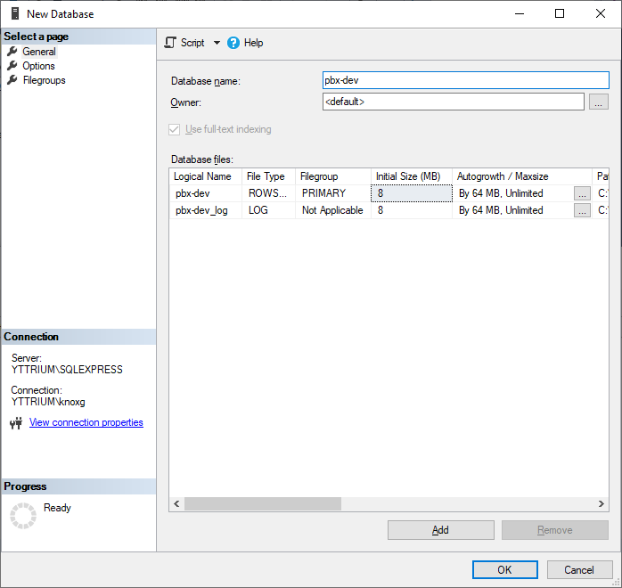
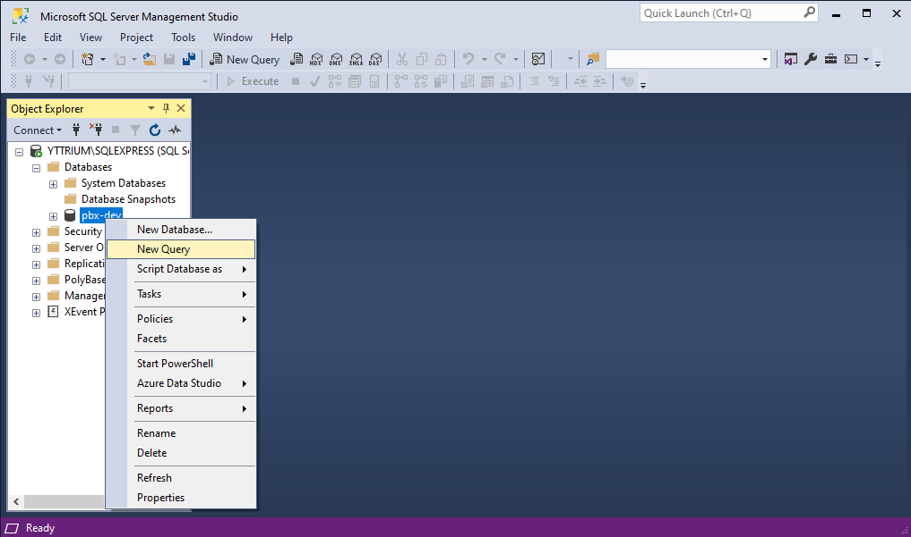
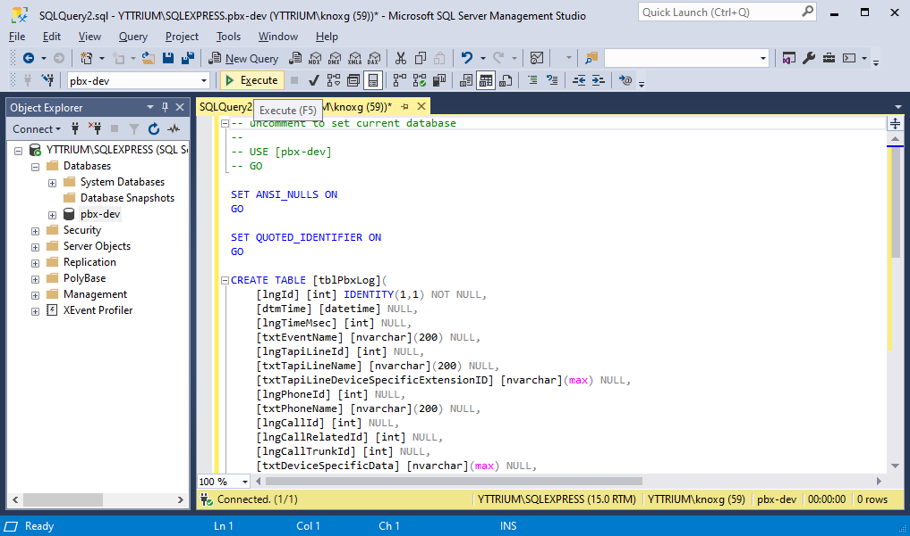
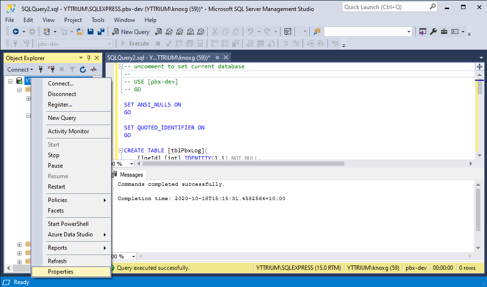
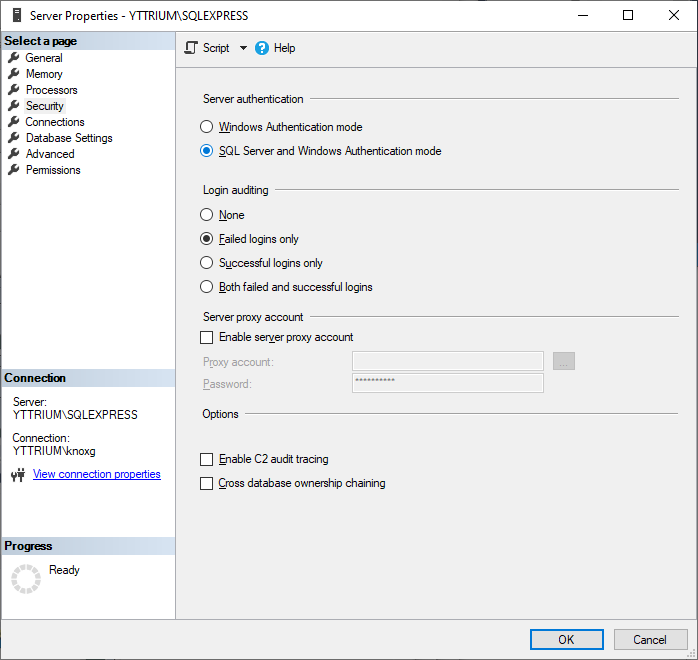
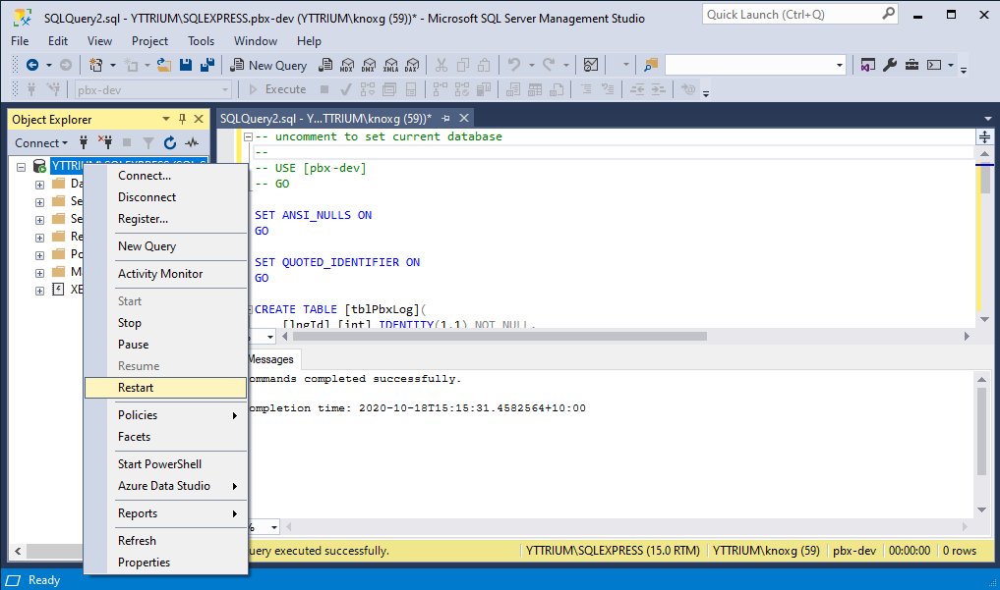
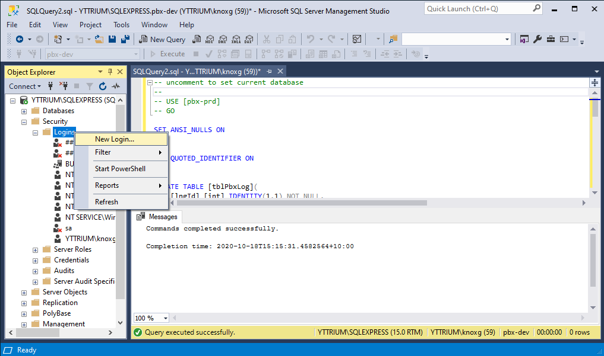

# Setting up the database

## Create the database

Log into SQL Server Express

Select SQLEXPRESS > Database > New Database...

Database name: pbx-dev

## Create the tblPbxLog table

Select SQLEXPRESS > Database > pbx-dev > New Query...

Paste in the contents of [something.sql](something.sql)
Click 'Execute'

## Enable username/password logins

Select SQLEXPRESS > Properties

Select 'Security' on the left hand side, then
Select 'SQL Server and Windows Authentication mode'
Click OK

Select SQLEXPRESS > Restart

## Create user

Select SQLEXPRESS > Security > Logins > New Login... 

Select 'General' on the left hand side, then
Login name: pbx-dev-username
SQL Server authentication
Password: pbx-dev-password
Confirm password: pbx-dev-password
(You probably want to set your own username and password here)

Select 'User Mapping' on the left hand side, then
Users mapped to this login: check pbx-dev 
Database role membership for pbx-dev: check db_owner
Click OK

## Enable protocols for username/password logins

Run Sql Server Configuration Manager
Select SQL Server Network Configuration > Protocols for SQLEXPRESS
Select TCP/IP > Enabled
Select Named Pipes > Enabled

Select SQL Server Services > SQLEXPRESS > Restart

## Test login

Reopen SQL Server Management Studio
Check that the new user login works
Authentication: SQL Server Authentication
Login: pbx-dev-username
Password: pbx-dev-password
Click Connect

If that all seem to work, then you should be able to set up your connection congfiguration in the registry and start the service

[Return to README.md](README.md)
